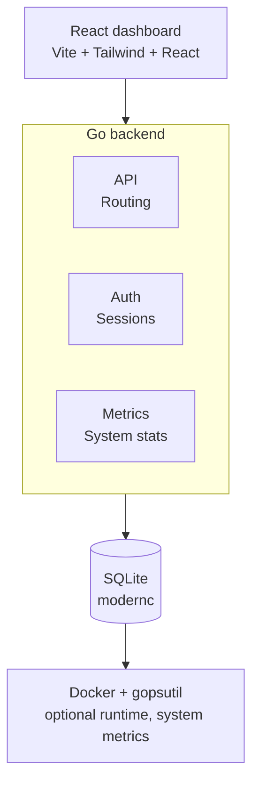

<div align="center">


# 🍈 KATHAL OS

### A production-grade, AI-powered, open-source Infrastructure Operating System

**Transforms any computer into a secure, portable hosting and development platform.**
*Docker, cloud, AI, DevOps, automation, and plugins — one unified ecosystem.*

<p>


</p>

<p>
<a href="https://github.com/Kathal-OS/Kathal"><b>Repository</b></a> •
<a href="https://github.com/Kathal-OS/Kathal/issues"><b>Issues</b></a> •
<a href="https://github.com/Kathal-OS/Kathal/discussions"><b>Discussions</b></a> •
<a href="https://github.com/Kathal-OS/Kathal/releases"><b>Releases</b></a> •
<a href="https://github.com/orgs/Kathal-OS/packages?repo_name=Kathal"><b>Packages</b></a>
</p>

</div>

<br/>

<div align="center">

</div>

<br/>

---
<div align="center">

## 📖 Table of Contents

<table>
<tr>
<td valign="top" width="33%">

**Get Running**
- ⚡ [Quick Start](#-quick-start)
- ✨ [Features](#-features)
- 🖥️ [Platform Support](#-platform-support)

</td>
<td valign="top" width="33%">

**Build & Extend**
- 🏗️ [Architecture](#-architecture)
- 🛠️ [Development](#-development)
- 🔌 [API Endpoints](#-api-endpoints)
- ⚙️ [Configuration](#-configuration)

</td>
<td valign="top" width="33%">

**Reference**
- 🗑️ [Uninstall](#-uninstall)
- 🔗 [Links](#-links)
- 📄 [License](#-license)

</td>
</tr>
</table>

---

## ⚡ Quick Start

### 🐳 Docker *(any platform)*

```bash
docker run -d --name kathal --restart unless-stopped \
  -p 8080:8080 \
  -v /var/run/docker.sock:/var/run/docker.sock \
  ghcr.io/Kathal-OS/kathal:latest
```

Open **http://localhost:8080**

### 🐧 Linux *(Ubuntu / Debian / Fedora / Arch)*

```bash
curl -fsSL https://raw.githubusercontent.com/Kathal-OS/kathal/master/scripts/install.sh | sudo bash
```

### 🍎 macOS

```bash
curl -fsSL https://raw.githubusercontent.com/Kathal-OS/kathal/master/scripts/install-mac.sh | bash
```

### 🪟 Windows

```powershell
powershell -ExecutionPolicy Bypass -File install.ps1
```

### 🔑 Login

| Field | Value |
|:---|:---|
| Email | `admin@kathal.local` |
| Password | `kathal` |

> ⚠️ Change the default credentials immediately after first login.

---

## ✨ Features

<div align="center">

| | | |
|:---|:---|:---|
| 📊 **Dashboard** — real-time CPU, RAM, disk, network metrics | 🐳 **Container Management** — start / stop / restart / delete | 🖼️ **Image Browser** — view all Docker images |
| 🛒 **App Store** — one-click deploy popular apps | 🔐 **JWT Authentication** — secure dashboard access | 🖥️ **System-Only Mode** — works without Docker |
| 🌍 **Cross-Platform** — Windows, Linux, Mac, Docker | 🔀 **Reverse Proxy** — auto SSL via Let's Encrypt + self-signed | 🗄️ **Database Management** — Postgres, MySQL, MongoDB, Redis |
| 📁 **File Manager** — browse, upload, edit files | 💾 **Backup / Restore** — ZIP export/import | 📦 **Service Templates** — 35+ pre-configured apps |
| 🔗 **Git Deploy** — GitHub/GitLab webhook deployments | 💻 **Web Terminal** — xterm.js PTY in browser | 📈 **Monitoring** — real-time metrics with history |
| 📜 **Logs** — centralized container log viewer | 🧩 **Docker Compose** — visual YAML editor + deploy | 🌐 **Network / Volume Management** |
| ⚙️ **Environment Variables** — global + per-service | | |

</div>

---

## 🏗️ Architecture



---

## 🖥️ Platform Support

<div align="center">

| Platform | Docker | System Metrics | Installer | Auto-Start |
|:---|:---:|:---:|:---:|:---:|
| 🐧 Linux    | ✅ | ✅ | ✅ bash | ✅ systemd |
| 🍎 macOS    | ✅ | ✅ | ✅ bash | ✅ launchd |
| 🪟 Windows  | ✅ | ✅ | ✅ PS1  | ⚠️ manual  |
| 🐳 Docker   | ✅ | ✅ | ✅      | ✅         |

</div>

---

## 🛠️ Development

### Prerequisites

<p>


</p>

### Build

```bash
# Backend
go build -o kathal ./cmd/kathal

# Frontend
cd web && npm install && npm run build

# Cross-compile
GOOS=linux GOARCH=amd64 go build -o kathal-linux-amd64 ./cmd/kathal
GOOS=darwin GOARCH=arm64 go build -o kathal-darwin-arm64 ./cmd/kathal
GOOS=windows GOARCH=amd64 go build -o kathal.exe ./cmd/kathal
```

### Run

```bash
./kathal
# Open http://localhost:8080
```

---

## 🔌 API Endpoints

<details open>
<summary><b>Auth</b></summary>

| Method | Path | Auth | Description |
|:---|:---|:---:|:---|
| `POST` | `/api/v1/login` | No | Get JWT token |

</details>

<details open>
<summary><b>System</b></summary>

| Method | Path | Auth | Description |
|:---|:---|:---:|:---|
| `GET` | `/api/v1/status` | Yes | Cross-platform system status |
| `GET` | `/api/v1/metrics` | Yes | CPU, RAM, disk, network metrics |
| `GET` | `/api/v1/system` | Yes | System info |

</details>

<details open>
<summary><b>Containers & Images</b></summary>

| Method | Path | Auth | Description |
|:---|:---|:---:|:---|
| `GET` | `/api/v1/containers` | Yes | List Docker containers |
| `POST` | `/api/v1/containers/{id}/start` | Yes | Start container |
| `POST` | `/api/v1/containers/{id}/stop` | Yes | Stop container |
| `POST` | `/api/v1/containers/{id}/restart` | Yes | Restart container |
| `DELETE` | `/api/v1/containers/{id}/delete` | Yes | Delete container |
| `GET` | `/api/v1/images` | Yes | List Docker images |

</details>

<details open>
<summary><b>Apps & Templates</b></summary>

| Method | Path | Auth | Description |
|:---|:---|:---:|:---|
| `GET` | `/api/v1/apps` | Yes | List managed apps |
| `POST` | `/api/v1/apps` | Yes | Create app |
| `GET` | `/api/v1/templates` | Yes | List service templates |

</details>

<details open>
<summary><b>Networking & Proxy</b></summary>

| Method | Path | Auth | Description |
|:---|:---|:---:|:---|
| `GET` | `/api/v1/proxy` | Yes | List proxy routes |
| `POST` | `/api/v1/proxy` | Yes | Create proxy route |
| `GET` | `/api/v1/network` | Yes | List networks |
| `GET` | `/api/v1/volumes` | Yes | List volumes |

</details>

<details open>
<summary><b>Databases & Files</b></summary>

| Method | Path | Auth | Description |
|:---|:---|:---:|:---|
| `GET` | `/api/v1/databases` | Yes | List databases |
| `POST` | `/api/v1/databases` | Yes | Create database |
| `GET` | `/api/v1/files` | Yes | List files |

</details>

<details open>
<summary><b>Backups & Git Deploy</b></summary>

| Method | Path | Auth | Description |
|:---|:---|:---:|:---|
| `GET` | `/api/v1/backups` | Yes | List backups |
| `POST` | `/api/v1/backups` | Yes | Create backup |
| `GET` | `/api/v1/git/repos` | Yes | List git repos |
| `POST` | `/api/v1/git/repos` | Yes | Add git repo |

</details>

<details open>
<summary><b>Monitoring & Logs</b></summary>

| Method | Path | Auth | Description |
|:---|:---|:---:|:---|
| `GET` | `/api/v1/monitoring/current` | Yes | Current metrics |
| `GET` | `/api/v1/monitoring/history` | Yes | Metrics history |
| `GET` | `/api/v1/logs/containers` | Yes | List log containers |
| `GET` | `/api/v1/logs` | Yes | Get container logs |

</details>

<details open>
<summary><b>Compose & Environment</b></summary>

| Method | Path | Auth | Description |
|:---|:---|:---:|:---|
| `GET` | `/api/v1/compose` | Yes | List compose projects |
| `GET` | `/api/v1/env` | Yes | List env vars |

</details>

---

## ⚙️ Configuration

### Environment Variables

| Variable | Default | Description |
|:---|:---|:---|
| `KATHAL_PORT` | `8080` | HTTP server port |
| `KATHAL_DB` | `./kathal.db` | SQLite database path |
| `KATHAL_ADDR` | `:8080` | Listen address |

### Config File

Create `config.json`:

```json
{
  "port": 8080,
  "logLevel": "info",
  "dbPath": "./kathal.db"
}
```

---

## 🗑️ Uninstall

<details>
<summary><b>🐧 Linux</b></summary>

```bash
sudo systemctl stop kathal
sudo systemctl disable kathal
sudo rm /etc/systemd/system/kathal.service
sudo rm -rf /opt/kathal /etc/kathal /var/lib/kathal
```

</details>

<details>
<summary><b>🍎 macOS</b></summary>

```bash
launchctl unload ~/Library/LaunchAgents/com.kathal.dashboard.plist
rm ~/Library/LaunchAgents/com.kathal.dashboard.plist
rm -rf ~/.kathal
```

</details>

<details>
<summary><b>🪟 Windows</b></summary>

```powershell
Remove-Item -Recurse "$env:LOCALAPPDATA\kathal"
```

</details>

---

## 🔗 Links

<div align="center">

<a href="https://github.com/Kathal-OS/Kathal"></a>
<a href="https://github.com/Kathal-OS/Kathal/issues"></a>
<a href="https://github.com/Kathal-OS/Kathal/discussions"></a>
<a href="https://github.com/Kathal-OS/Kathal/releases"></a>
<a href="https://github.com/orgs/Kathal-OS/packages?repo_name=Kathal"></a>

</div>

---

## 📄 License

<div align="center">

**MIT** — Built for the community.

🍈 **KATHAL OS**
Built by **BakeWeb** in collaboration with **SunDial Technology**

</div>
